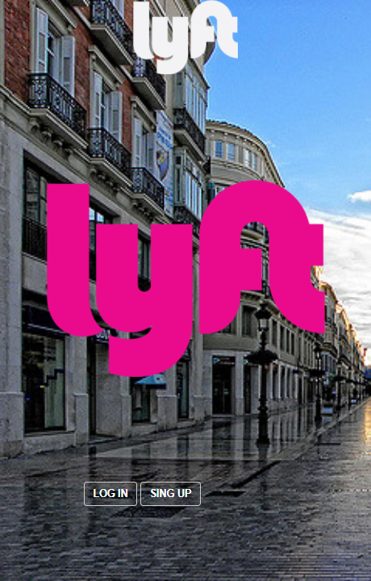
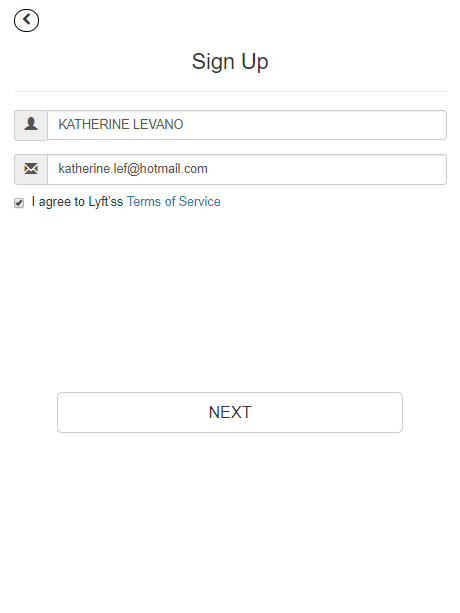
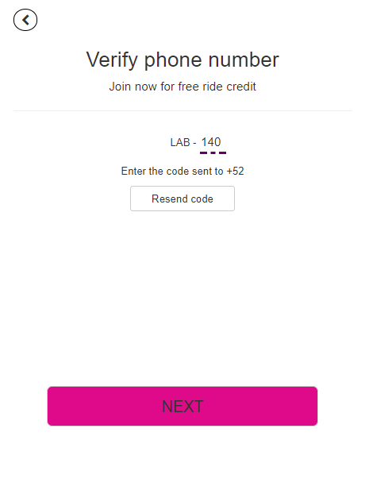

# LYFT

* **Sprint 3:** _CREA TU PROPIA RED SOCIAL_
* **Unidad 3:** _AGILIZA TU DESARROLLO_

***

Desarrolla una web-app que replique el sitio de Lyft, en este reto deberás cumplir los pasos necesarios para que tu usuario pueda registrarse.

## DESARROLLO

FLUJO DE LA APLICACIÓN:

1. Vista splash con duración de 2 a 5 segundos que redirecciona a tu vista de inicio. La vista de inicio cuenta con dos botones, en esta ocasión seguiremos el flujo de SING UP.

2. En la siguiente vista tenemos un formulario donde nuestro usuario puede escoger el país y debe ingresar su número de teléfono. El botón de NEXT debe estar deshabilitado hasta que se ingrese un número de 10 dígitos.

3. Una vez ingresado el número de teléfono se habilita el botón y al dar click debe enviar una alerta con un código generado aleatoriamente (LAB-000) y redireccionar a la siguiente vista.

4. En esta vista se debe ingresar el código dado anteriormente y una vez hecho esto se habilita el botón que redirecciona a nuestro usuario a la vista donde ingresa sus datos. (Puede tener la opción de enviar otro código.)

5. Para ingresar sus datos necesitamos un formulario que le pida su nombre, apellido y correo electrónico. Deberá también tener un checkbox para que se acepten los términos y condiciones del servicio.

6. Ya que se ha realizado lo anterior, sólo se deberá mostrar una vista al usuario que le indique que ha concluido con el registro exitosamente.

## RESULTADO

